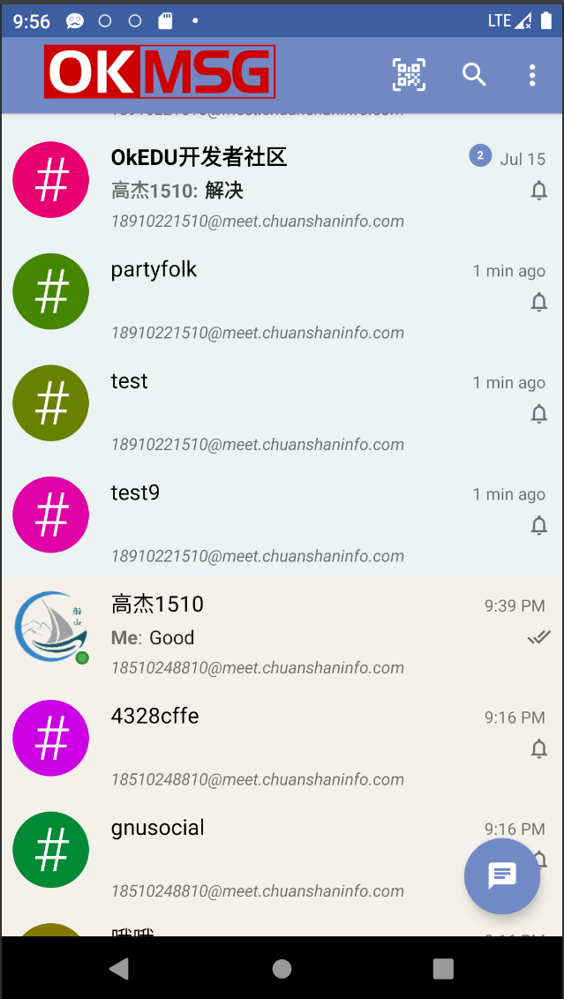

<h1 align="center">OkEDU - Android</h1>

# 🎁 项目介绍

**OkMSG 面向企业内部沟通的开源即时通讯软件，可以实现两人或多人之间的实时沟通！**
- 交流内容包括文字、语音、视频及文件等。
- 注重实用性、稳定性和扩展性，同时可以按照客户需求进行定制。
- 具备很好的跨平台性，支持Windows、Linux、macOS、Android、iOS等平台。
- 最大限度保障企业数据安全和隐私，支持消息端到端消息加密，支持企业独立私有化部署。

# 🧭 功能介绍

- 聊天模块
  - 具备单聊、群聊；
  - 支持文字、音视频、文件传输等基本功能；
  - 消息加密（计划中）。

# 🖼️ 界面展示

> 登录界面

> 消息主界面

# 🖥️ 支持平台

> 🐧 Linux
- Ubuntu  已支持
- Fedora  计划中

> 🪟 Windows
- Windows10+ 已支持

> 🤖 Android
- Android 5.0+ 已支持

> 🍎 macOS
- 计划中

> 🍎 iOS
- 计划中

# 📦 欢迎体验

- 下载地址：https://www.chuanshaninfo.com/download/OkEDU/
- 测试帐号：ok_1001到ok_1005，密码:okedu
- 更多请加微信：chuanshantech

# 🙏 感谢支持

- 感谢配合测试的同学，有赵慧、戴斌、沈雪琪等
- [感谢 JetBrains 对本项目的支持（Drive by JetBrains）](https://jb.gg/OpenSourceSupport) 

# ❤️ 捐赠方式

> 您的捐款是OkEDU开源项目持续前进的动力，希望该项目可以让任何人从中受益。
> 捐赠列表 https://kdocs.cn/l/cr7rVyXnbxuK

 

> 欢迎大家 Clone 本项目，捐赠收入将用于对贡献者的奖励。

# ⏰ 任务规划

- 2023年
  1. 完成项目基本功能
  2. 开启社区基本建设
  3. 开启社区项目内测
- 2024年
  1. 完成对各系统平台的支持
  2. 登录到各平台面向消费者
  3. 开启商业定制之路

> 【金山文档】 OkEDU任务列表 https://kdocs.cn/l/csib86aYwx0P

# 🏭 社区建设

> 为了OkEDU项目能长期有序有质量发展，诚邀有梦想情怀人士加入，一起建设社区，
> 目前规划需要如下方面人才：

- 开发、问题反馈、 Bug修复
- 文档、翻译、设计、品控
- 支持、推广、投资、项目管理

> 社区模式：敬请期待。。。

- 欢迎加入 [OkStar 社区](http://okstar.org)

# 🧑‍🤝‍🧑 贡献者

> 欢迎加入参与社区建设

- Joy1024
- 赵慧
- 漫步（化名）
- [更多](https://gitee.com/chuanshantech/ok-edu-classroom-desktop/contributors?ref=master)

# 💰 赞助商

- Joy1024（个人）

# ☎️ 联系我们

> 技术交流群，添加微信：**chuanshantech**（备注：OkEDU 姓名）

> 微信公众号，关注账号：**OkEDU**

# ©️ 版权信息

> 本软件已经申请软件著作权和商标。

- ™️ 商标：**OkEDU** ® `
``
`
- 📄 软著: `
``
`

> 本项目采用双重授权，请按合规正确使用本项目！

1.遵循软件分发协议

- 国际：**[GPL-2.0](https://opensource.org/license/gpl-2-0/)**
- 中国：**[木兰公共许可证, 第2版](https://opensource.org/license/mulanpsl-2-0/)**

2.付费得到商业授权（试行）

- [OKEDU软件合作伙伴合同-个人版](https://www.kdocs.cn/l/cgdtyImooeol)
- OKEDU软件合作伙伴合同-团队版(计划中)
- OKEDU软件合作伙伴合同-企业版(计划中)

